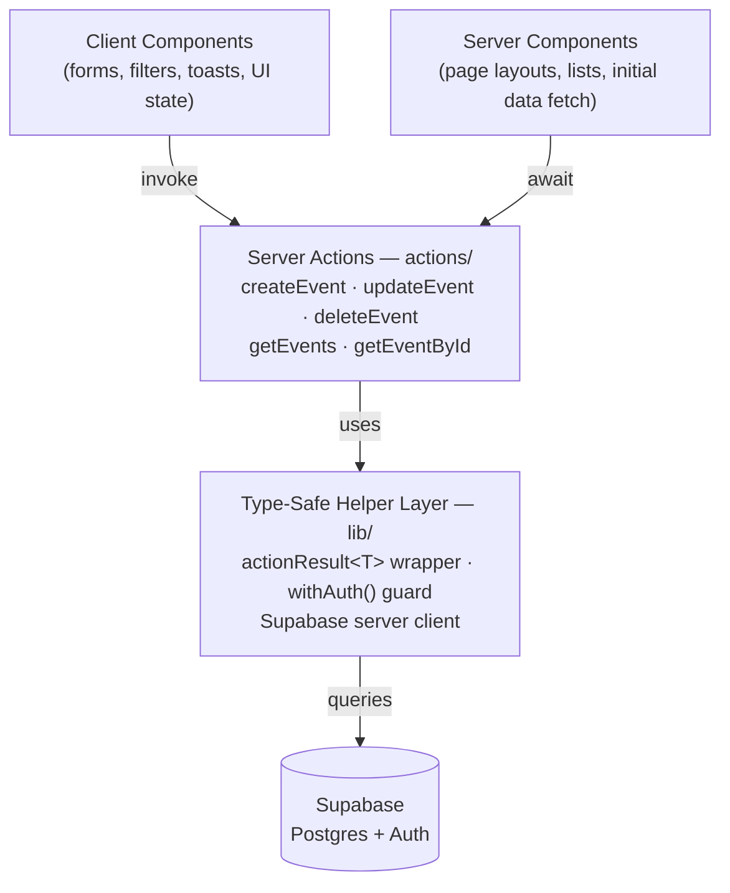

# Architecture: Fastbreak Event Dashboard

## Tech Stack

| Layer           | Choice                        | Reason                                                                |
| --------------- | ----------------------------- | --------------------------------------------------------------------- |
| Framework       | Next.js 15 (App Router)       | Required; RSC + Server Actions fit the server-side-only DB constraint |
| Language        | TypeScript                    | Required; enables the type-safe helper pattern                        |
| Database + Auth | Supabase                      | Required; Postgres + built-in Auth with Google OAuth                  |
| Styling         | Tailwind CSS + shadcn/ui      | Required; fast, consistent, accessible UI                             |
| Forms           | react-hook-form + shadcn Form | Required                                                              |
| Deployment      | Vercel                        | Required; zero-config Next.js deployment                              |

---

## Architecture Diagram



---

## Database Schema

```sql
-- Managed by Supabase Auth
-- auth.users (id, email, ...)

-- Enum for sport types (hardcoded, consistent filtering)
create type sport_type_enum as enum (
  'Soccer', 'Basketball', 'Tennis', 'Baseball',
  'Volleyball', 'Rugby', 'Hockey', 'American Football'
);

create table events (
  id          uuid primary key default gen_random_uuid(),
  user_id     uuid not null references auth.users(id) on delete cascade,
  name        text not null,
  sport_type  sport_type_enum not null,
  starts_at   timestamptz not null,
  description text,
  created_at  timestamptz default now(),
  updated_at  timestamptz default now()
);

create table venues (
  id        uuid primary key default gen_random_uuid(),
  event_id  uuid not null references events(id) on delete cascade,
  name      text not null,
  address   text
);

-- RLS: users can only read/write their own events and venues
-- events: WHERE user_id = auth.uid()
-- venues: via event ownership (policy joins through event_id)
```

---

## Key Technical Decisions

### 1. Server Actions over API Routes

Aligns with Fastbreak's stated direction. All mutations (`createEvent`, `updateEvent`, `deleteEvent`) are Server Actions. Data fetching uses Server Components directly or server-side calls — no client-side Supabase access anywhere.

### 2. `actionResult<T>` helper

A shared wrapper around all server action returns for a consistent error surface:

```ts
type ActionResult<T> =
  | { success: true; data: T }
  | { success: false; error: string };
```

Every action returns this shape. Client components destructure `success` before rendering or showing a toast.

### 3. `withAuth()` guard

Wraps server actions to verify the session before any DB call. Returns an error result (or redirects) on unauthenticated access — no action can be invoked without a valid session.

### 4. Server-side search + filter

The dashboard search (by name) and filter (by sport type) trigger a new server action call — not client-side filtering. This satisfies the challenge requirement to "refetch from the database" and keeps the logic server-owned.

### 5. Offset pagination

20 events per page, page number passed as a URL search param (`?page=2`). Simple `LIMIT 20 OFFSET (page-1)*20` query. Numbered page controls rendered in the dashboard UI.

### 6. Venues as child records

Venues are tightly coupled to an event (cascade delete on `event_id`). Fields: name + address only. No reusable venue library — keeps the schema flat and the form logic straightforward.
